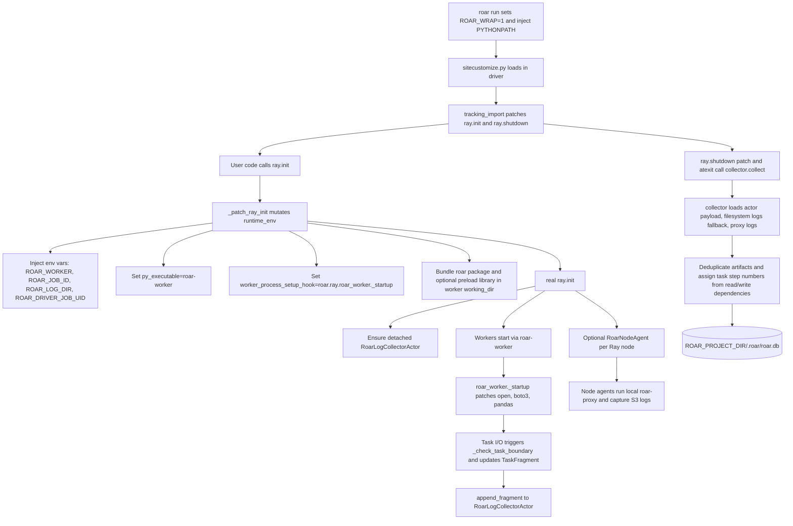
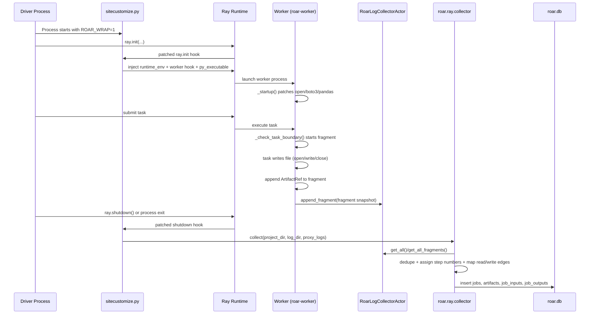

# Ray Integration (Developer)

## 1. High-level summary

roar's Ray integration instruments both the Ray driver and Ray workers so worker-side I/O can be persisted as lineage in `.roar/roar.db`. The driver-side hook lives in `sitecustomize.py` and activates when `ROAR_WRAP=1` (normally set by `roar run`). It patches `ray.init()` to inject a worker runtime that boots `roar-worker`, installs worker instrumentation, and creates cluster-side aggregation actors.

At runtime, workers emit `TaskFragment` snapshots (reads/writes plus Ray task metadata) to a detached `RoarLogCollectorActor`. During shutdown, the driver collects actor payloads (and optional per-node proxy logs), deduplicates artifacts, assigns Ray-task step numbers from dependency topology, and writes final job/artifact edges into `.roar/roar.db`.

## 2. Architecture overview

## 3. Component-by-component breakdown

### `sitecustomize.py`

- Activation gate: Ray patching is only attempted when `ROAR_WRAP=1` and `ray` is imported.
- `ray.init` patch:
  - Loads Ray config (`ray.enabled`, `ray.log_dir`, explicit `ray.pip_install`).
  - Builds/merges `runtime_env`.
  - Injects worker env vars:
    - `ROAR_WORKER=1`
    - `ROAR_LOG_DIR`
    - `ROAR_LOG_BACKEND=actor`
    - `ROAR_JOB_ID`
    - `ROAR_DRIVER_JOB_UID`
  - Propagates AWS env vars to workers when present.
  - Rewrites worker runtime via `_prepare_worker_runtime_env`:
    - Copies existing local `working_dir` into a temp worker bundle.
    - Copies the `roar` package into that bundle.
    - Copies `libroar_tracer_preload.so` when available.
    - Sets `py_executable` to `roar-worker`.
    - Sets `worker_process_setup_hook` to `roar.ray.roar_worker._startup`.
  - Sanitizes reserved Ray hook env keys for Ray versions that reject manual setup-hook env export.
  - Calls real `ray.init`, then registers pre-shutdown collection and ensures the collector actor exists.
  - Optionally starts node-agent bootstrap and autoscaling poller.
- `ray.shutdown` patch: collects Ray I/O first, then calls real `ray.shutdown`.
- `ROAR_WRAP` behavior: this entire integration path is effectively dormant unless `ROAR_WRAP=1`.

### `roar-worker` entrypoint (`roar_worker.py`)

- Used as `runtime_env.py_executable` (`roar-worker` console script).
- `main()` calls `_startup()` then `os.execvp("python3", ["python3", *argv])` to run Ray's worker command.
- `_startup()` installs worker instrumentation once:
  - `builtins.open` patch (`_tracking_open`) for local file events.
  - boto3 S3 client patch (Put/Get/Upload instrumentation).
  - pandas `DataFrame.to_parquet` patch.
  - atexit flush for the current fragment.
  - actor attribution mode (`ray.actor_attribution`: `per_call` or `per_actor`).
- Task boundaries:
  - `_check_task_boundary()` compares current boundary (task id or actor id) to `_current_task_id`.
  - On boundary change, finalizes previous fragment and starts a new `TaskFragment`.
- Fragment emission:
  - Local writes are hashed streaming (blake3 if available, else sha256) in `_TrackedWriteFile` and logged on `close()`.
  - Local reads append read refs (no content hash/size by default in this path).
  - S3 operations log `ArtifactRef` entries with `hash_algorithm="etag"` and captured size where available.
  - Every read/write updates fragment timestamps and emits a snapshot to `RoarLogCollectorActor.append_fragment`.

### `RoarLogCollectorActor` (`actor.py`)

- Detached, named Ray actor in namespace `roar`.
- In-cluster aggregation point with two buffers:
  - event batches (`append_batch` / `get_all`) for event-style payloads.
  - fragment snapshots (`append_fragment` / `get_all_fragments`) for task-fragment payloads.

### `collector.py`

- Driver-side post-run collector invoked during shutdown/atexit.
- Data sources:
  - actor payload (`get_all`, `get_all_fragments`),
  - filesystem JSONL fallback logs,
  - optional node-agent proxy logs.
- Writes to `ROAR_PROJECT_DIR/.roar/roar.db`.
- Dedup behavior:
  - Event aggregation path deduplicates by artifact path, keeps strongest `capture_method` (`python < proxy < tracer`), keeps max observed size, and records read/write role.
  - Fragment path (`collect_fragments`) deduplicates by `(algorithm, digest)` via `artifact_hashes`; if no hash, falls back to latest artifact by path.
- Step-number topology algorithm (`_assign_step_numbers`):
  - Builds a DAG where edge `producer -> consumer` exists when consumer reads a hash written by producer.
  - Collapses incremental snapshots by `job_uid` before graphing.
  - Performs topological traversal to compute depth.
  - Assigns `step_number = base_step + depth` (driver is base step; Ray tasks start at `base + 1`).
  - Cycles fall back to a deeper bucket.

### `fragment.py`

- `ArtifactRef`: normalized artifact reference (`path`, `hash`, `hash_algorithm`, `size`, `capture_method`).
- `TaskFragment`: per-task (or per-actor) snapshot with IDs, timing, exit status, reads/writes, and optional worker package map.
- `derive_task_uid(job_id, ray_task_id)`: deterministic 8-hex UID via blake2b digest of `"{job_id}:{ray_task_id}"`.

### `worker.py`

- Alternate/legacy worker hook module centered on event logging (not fragment snapshots).
- `setup()` patches `open` and optionally SDK/data paths.
- Backend selection:
  - `actor` or `filesystem` via `ROAR_LOG_BACKEND`,
  - auto-detect fallback uses sentinel write in `ROAR_LOG_DIR`.
- Optional worker-side integrations:
  - boto3 S3 logging,
  - pandas parquet logging,
  - pyarrow filesystem wrappers,
  - Ray Data read/write wrappers,
  - per-node proxy endpoint wiring via `_configure_local_proxy_endpoint`.
- Intended role: broader Python-side coverage and proxy endpoint wiring; useful with native tracer/proxy workflows.

### `node_agent.py`

- Defines `RoarNodeAgent` Ray actor (per node).
- Starts a local `roar-proxy` subprocess pinned to each node, waits for `ROAR_PROXY_READY`, and records stdout lines.
- Exposes:
  - `get_proxy_port()` so workers can set `AWS_ENDPOINT_URL` to local proxy.
  - `collect_logs()` for driver-side retrieval/merge.
  - `shutdown()` for controlled teardown.

## 4. Sequence diagram (single Ray task lifecycle)

## 5. Configuration reference

### Environment variables

| Variable | Scope | Effect |
|---|---|---|
| `ROAR_WRAP` | Driver | Master switch for runtime patching in `sitecustomize.py`. Must be `1` to activate Ray integration. |
| `ROAR_JOB_ID` | Driver + workers | Ray run/job identifier used for actor naming and deterministic task UID derivation. Generated if absent. |
| `ROAR_PROJECT_DIR` | Driver | Project root used to locate `.roar/roar.db` and load config. |
| `ROAR_LOG_DIR` | Driver + workers | Worker log directory fallback path (default `/shared/.roar-logs`). |
| `ROAR_LOG_BACKEND` | Workers | Event backend choice (`actor` or `filesystem`); Ray patch currently forces `actor` in worker env vars. |
| `ROAR_WORKER` | Workers | Marker set to `1` in worker runtime_env to indicate worker context. |
| `ROAR_DRIVER_JOB_UID` | Workers | Parent job UID used when emitting task fragments (`TaskFragment.parent_job_uid`). |

### `roar` config keys

| Key | Default | Behavior |
|---|---|---|
| `ray.enabled` | `true` | Enables/disables `ray.init` runtime_env injection. |
| `ray.log_dir` | `/shared/.roar-logs` | Default worker log directory used for filesystem fallback and collection. |
| `ray.pip_install` | explicit-only in current runtime loader | When explicitly set true in config, injects current `roar` requirement into `runtime_env.pip`. |
| `ray.actor_attribution` | `per_call` | Fragment boundary mode in `roar_worker`: per task call (`per_call`) or per actor (`per_actor`). |

## 6. Known limitations / caveats

- `roar_worker` local file capture is restricted to paths under `/shared/`.
- Local file reads in `roar_worker` are recorded as read events without content hashing/byte size.
- S3 identity uses ETag (`hash_algorithm="etag"`), which is not always a true content hash (for example, multipart semantics).
- `append_fragment` emission is best-effort; actor lookup/remote failures are swallowed to avoid breaking user tasks.
- Multi-node proxy capture depends on optional node agents and a discoverable `roar-proxy` binary.
- Some Ray Client execution paths may require explicit `roar_worker._startup()` in remote functions (seen in e2e/live tests).
- Runtime pip injection is controlled by explicit config presence for `ray.pip_install` in current implementation, not just model defaults.
