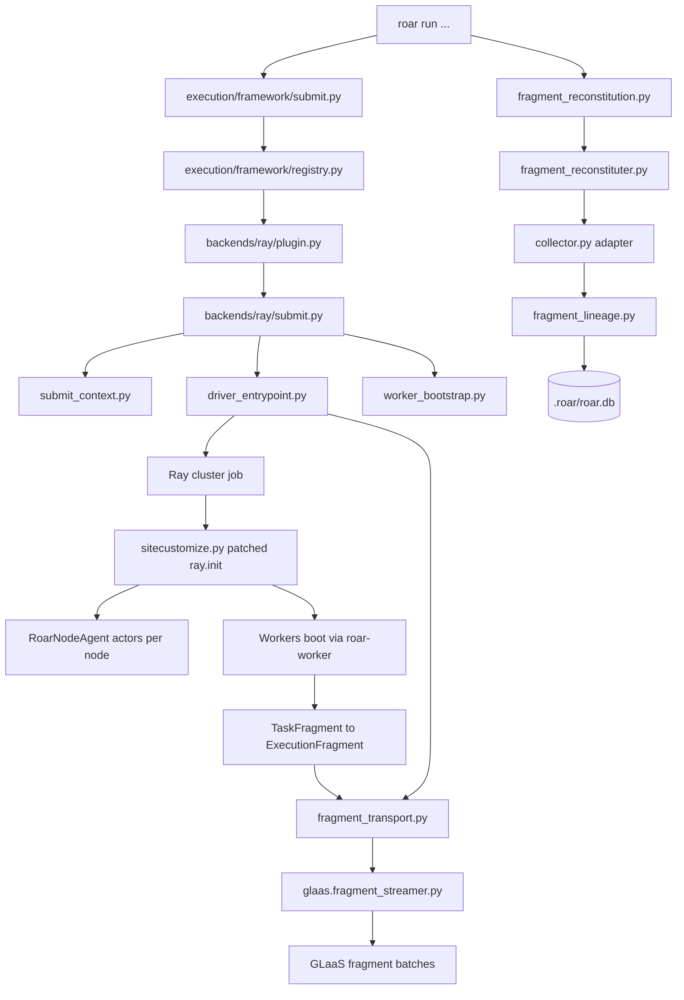
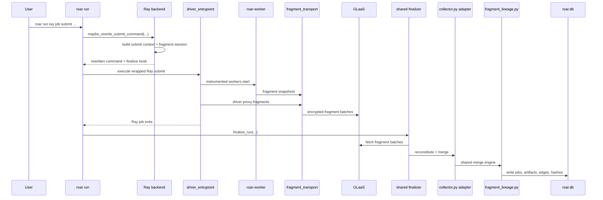

# Ray Integration (Developer)

## 1. High-level summary

The Ray integration now has two distinct layers:

- A shared distributed-execution backend contract that owns submit rewrite, driver bootstrap, worker bootstrap, fragment-session handling, and post-run reconstitution.
- A Ray backend implementation that plugs Ray-specific runtime behavior into that shared contract while delegating transport, lineage merge, and cluster-bridge lifecycle to shared execution-layer modules.

The canonical extension points now live under:

- `roar.execution.framework.*` for the shared backend framework
- `roar.backends.ray.*` for the concrete Ray adapter

The Ray submit path now lives entirely under `roar.backends.ray.*`. The remaining legacy
imports are limited to compatibility wrappers around older shared-framework module paths.

If you want to add another backend on top of this framework, start with `docs/developer/execution-backend-adapter.md`.

For the main product path, fragments no longer flow through a detached collector actor. Workers and the driver stream fragments directly with `GlaasFragmentStreamer`, and `run.py` calls a Ray finalizer after `ray job submit` completes.

## 2. Architecture overview

## 3. Main components

### a. Generic submit hook

- `roar/execution/framework/submit.py`
  - Finds the matching distributed backend and delegates submit-command rewrite to it.
  - Attaches the shared submit finalizer automatically when the backend returns a fragment session id.
- `roar/execution/framework/contract.py`
  - Defines the shared backend contract:
    - match a submit command
    - rewrite the command
    - provide driver bootstrap callbacks
    - provide worker bootstrap callbacks
    - provide fragment reconstitution callbacks
- `roar/execution/framework/registry.py`
  - Loads built-in backends and optional `roar.execution_backends` entrypoints.
- `roar/services/execution/fragment_reconstitution.py`
  - Owns the shared post-run finalizer that loads fragment session credentials and dispatches to the backend reconstituter.
- `roar/cli/commands/run.py`
  - Calls the generic rewrite hook before execution.
  - Calls the shared finalizer after execution.

This is the generalization seam for future distributed integrations.

### b. Ray execution backend

- `roar/backends/ray/plugin.py`
  - Registers Ray as a `roar.execution_backends` backend.
  - Supplies Ray-specific callbacks for:
    - submit rewrite matching
    - driver proxy fragment construction
    - worker bootstrap startup and entrypoint execution
    - fragment reconstituter construction
- `roar/backends/ray/submit.py`
  - Detects `ray job submit`.
  - Rewrites the entrypoint through `python -m roar.services.execution.driver_entrypoint`.
  - Shapes worker-facing env vars and runtime env.
  - Pre-registers fragment sessions when GLaaS is configured.
  - Returns a fragment session id; the shared finalizer handles reconstitution afterward.

### c. Submit context and env contract

- `roar/ray/submit_context.py`
  - Builds job-scoped submit context:
    - `ROAR_JOB_ID`
    - job-scoped proxy port
    - local project dir
    - host-visible vs cluster-visible endpoints
- `roar/ray/env_contract.py`
  - Centralizes worker/bootstrap env propagation:
    - cluster-visible GLaaS URL
    - upstream S3 endpoint
    - fragment session env
    - proxy env

These two modules are the main backend-neutral extraction from the older inline Ray rewrite.

### d. Driver bootstrap

- `roar/services/execution/driver_entrypoint.py`
  - Runs inside the distributed job instead of the user entrypoint directly.
  - Resolves the active execution backend from `ROAR_EXECUTION_BACKEND`.
  - Starts driver-local proxy capture when needed.
  - Preserves loopback proxy routing for the child process.
  - Emits driver proxy fragments through the shared `fragment_transport.py` helper.
- `roar/ray/driver_entrypoint.py`
  - Compatibility wrapper over the shared driver entrypoint module.

### e. Ray startup patching

- `roar/services/execution/inject/sitecustomize.py`
  - Patches `ray.init` and `ray.shutdown` when `ROAR_WRAP=1`.
  - Applies the shared worker env contract.
  - Uses the shared worker bootstrap contract to package worker runtime env.
  - Starts per-node `RoarNodeAgent` spawn in the background for instrumented jobs.

This path still matters for nested `ray.init(...)` inside already instrumented jobs.

### f. Worker bootstrap and capture

- `roar/services/execution/worker_bootstrap.py`
  - Owns the shared worker bootstrap interface.
  - Provides the generic `worker_process_setup_hook` path and the `roar-worker` executable entrypoint.
  - Resolves the active execution backend from `ROAR_EXECUTION_BACKEND` and dispatches startup/entrypoint execution to it.
- `roar/ray/roar_worker.py`
  - Implements Ray-specific worker startup and final worker exec behavior.
  - Installs local file, S3, proxy, pandas, native, and thread attribution hooks.
  - Builds `TaskFragment` snapshots with deterministic task identity.
  - Uses the shared fragment transport path for one-shot emissions and the shared GLaaS streamer for buffered direct streaming.

### g. Node agent and proxy isolation

- `roar/ray/node_agent.py`
  - Runs a per-node detached actor that wraps the shared cluster bridge.
  - Uses job-scoped proxy ports instead of a fixed global port.
  - Reuses sidecars only when local ownership claims match the current job and upstream.
  - Returns proxy logs to the driver for reconstitution.

- `roar/ray/proxy_config.py`
  - Shared local proxy port parsing and loopback endpoint helpers.
- `roar/services/execution/cluster_bridge.py`
  - Shared proxy sidecar lifecycle and ownership-claim logic.
  - Encapsulates reuse checks, startup, readiness waiting, and teardown.

### h. Fragment transport and reconstitution

- `roar/services/execution/fragment_sessions.py`
  - Owns fragment-session key generation and on-disk storage.
- `roar/glaas/fragment_streamer.py`
  - Buffers fragments, encrypts batches, and posts them to GLaaS.
- `roar/services/execution/fragment_transport.py`
  - Centralizes "stream to GLaaS or fall back locally" behavior.
- `roar/services/execution/fragment_reconstitution.py`
  - Owns the shared submit finalizer and backend-driven reconstitution dispatch.
- `roar/services/execution/fragment_models.py`
  - Defines the backend-neutral `ExecutionFragment` envelope under the Ray compatibility wrapper.
- `roar/services/execution/fragment_lineage.py`
  - Owns shared fragment merge, identity resolution, dependency reconstruction, and DB persistence.
- `roar/ray/fragment_reconstituter.py`
  - Implements Ray-specific batch fetch, decrypt, dedupe, and composite-materialization behavior.
- `roar/ray/collector.py`
  - Adapts Ray fragments into the shared fragment lineage merge engine.
  - Keeps Ray-specific filtering and metadata shaping out of the shared merge path.

## 4. Current data flow

## 5. Important config and env

| Key | Source | Purpose |
|---|---|---|
| `ROAR_WRAP` | env | Enables `sitecustomize.py` Ray patching. |
| `ROAR_JOB_ID` | env | Shared Ray job identity for driver, workers, and node agents. |
| `ROAR_EXECUTION_BACKEND` | env | Selects the active distributed backend contract at runtime. |
| `ROAR_PROXY_PORT` | env | Job-scoped local proxy port. |
| `ROAR_PROJECT_DIR` | env | Local repo root that owns the `.roar` database. |
| `ROAR_CLUSTER_GLAAS_URL` | env | Cluster-visible GLaaS URL override. |
| `ROAR_CLUSTER_AWS_ENDPOINT_URL` | env | Cluster-visible upstream S3 endpoint override. |
| `ROAR_SESSION_ID` / `ROAR_FRAGMENT_TOKEN` | env | Fragment session credentials for GLaaS streaming. |
| `ray.enabled` | `roar.toml` | Enables Ray runtime env injection. |
| `ray.pip_install` | `roar.toml` | Controls whether Roar injects itself into `runtime_env.pip`. |

## 6. Notes and caveats

- Host-visible and cluster-visible endpoints are modeled separately on purpose. Do not collapse them into one URL.
- Product-path confidence should come from `roar run ray job submit ...` e2e/live tests, not from direct `ray://` client-mode tests.
- `ray_task:unknown`, `ray_task:__init__`, `ray_task:shutdown`, and proxy/bootstrap commands are treated as internal noise for registration and DAG presentation.
- The detached collector actor has been removed. Direct fragment streaming plus shared submit finalization is the only supported transport path.
- The shared execution-layer modules are now the required extension surface for future distributed backends. New backends should register a full `roar.execution_backends` contract rather than wiring new logic directly into `run.py` or Ray-specific modules.
