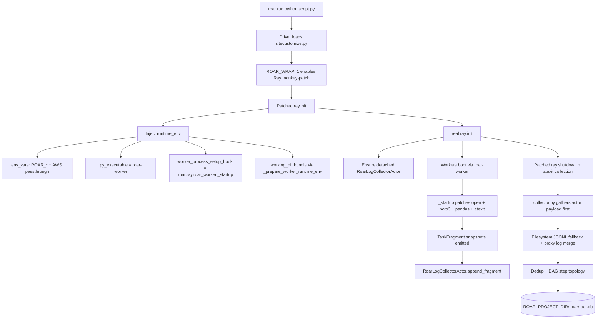
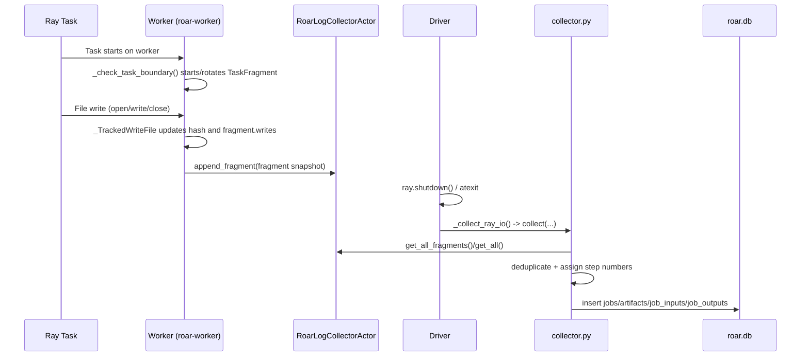

# Ray Integration (Developer)

## 1. High-level summary

When `roar run` executes a Ray workload, the driver process patches Ray startup/shutdown and injects worker instrumentation through Ray `runtime_env`. That worker instrumentation emits per-task I/O fragments (local file + S3 touches with task metadata) to a detached in-cluster collector actor.

At shutdown, the driver gathers collected fragments/events, merges optional proxy/node-agent logs, deduplicates artifacts, reconstructs task ordering from read/write dependencies, and writes Ray task lineage into `ROAR_PROJECT_DIR/.roar/roar.db`.

## 2. Architecture overview

## 3. Component-by-component breakdown

### a. `sitecustomize.py`

- Patching gate: `tracking_import` patches Ray only when `ROAR_WRAP=1` and `ray` is imported.
- `ray.init` patch (`_patch_ray_init`):
  - Loads `[ray]` config (`enabled`, `log_dir`, explicit `pip_install`).
  - Builds `runtime_env` and `env_vars`.
  - Injects worker env vars:
    - `ROAR_WORKER=1`
    - `ROAR_LOG_DIR=<configured ray.log_dir or ROAR_LOG_DIR>`
    - `ROAR_LOG_BACKEND=actor`
    - `ROAR_JOB_ID=<generated or supplied>`
    - `ROAR_DRIVER_JOB_UID=<driver ROAR_JOB_ID>`
    - selected AWS vars passed through when present.
  - Optionally injects a pinned `roar` dependency into `runtime_env.pip` when `ray.pip_install=true`.
  - Calls `_prepare_worker_runtime_env(runtime_env, job_id)`:
    - Creates a temp worker bundle dir.
    - Merges local `working_dir` contents into that bundle (if local path).
    - Copies the `roar` package into bundle.
    - Copies `libroar_tracer_preload.so` when available.
    - Sets `runtime_env["working_dir"]` to bundle.
    - Sets `runtime_env["py_executable"] = "roar-worker"`.
    - Sets `runtime_env["worker_process_setup_hook"] = "roar.ray.roar_worker._startup"` and mirrors it via internal env var.
  - Sanitizes reserved setup-hook env key for Ray versions that reject manual export (`_sanitize_worker_runtime_env_for_ray`).
  - After real `ray.init`, registers pre-shutdown collection and ensures `RoarLogCollectorActor` exists.
- `ray.shutdown` patch (`_patch_ray_shutdown`): collects Ray I/O first (`_collect_ray_io`), then calls real shutdown.
- `_collect_ray_io`: calls `roar.ray.collector.collect(project_dir, log_dir, proxy_logs)` when `ROAR_WRAP=1`.

### b. `roar-worker` entrypoint (`roar/ray/roar_worker.py`)

- Role: this module is the worker `py_executable` (`roar-worker`).
- `main()` calls `_startup()` then `execvp("python3", ...)` to run Ray’s normal worker command.
- `_startup()` installs worker instrumentation once:
  - `builtins.open` patch (`_tracking_open`)
  - boto3 S3 client patch (`put_object`, `upload_file`, `get_object`)
  - pandas `DataFrame.to_parquet` patch
  - `atexit` flush of active fragment
  - actor attribution mode from config: `ray.actor_attribution = per_call|per_actor`
- Task boundary handling:
  - `_check_task_boundary()` computes boundary from `_get_task_id()` (or actor id in `per_actor` mode).
  - On boundary change, finalizes previous fragment and starts a new one with `_start_fragment()`.
- Fragment emission:
  - `TaskFragment` includes Ray IDs, function name, timing, exit code, and `reads`/`writes` of `ArtifactRef`.
  - Local write hashing is streaming (`blake3` if installed, otherwise `sha256`) via `_TrackedWriteFile`.
  - Local path capture is restricted to `/shared/...` (`_should_track_local_path`).
  - S3 refs use `hash_algorithm="etag"` and size where available.
  - `_emit_fragment()` sends snapshots to `RoarLogCollectorActor.append_fragment.remote(fragment.to_dict())`.

### c. `RoarLogCollectorActor` (`roar/ray/actor.py`)

- Detached, named actor (`roar-log-collector-<ROAR_JOB_ID>`, namespace `roar`).
- Aggregation point for worker payloads:
  - `append_fragment` / `get_all_fragments` for fragment snapshots.
  - `append_batch` / `get_all` for event batches.

### d. `collector.py`

- Driver-side shutdown collector.
- Collection order:
  - `_collect_actor_payload()` first (events + fragments from named actor).
  - If only fragments are present, can synthesize events (`_events_from_fragments`) and/or write fragments directly (`collect_fragments`).
  - Falls back to filesystem logs (`*.jsonl` under `ROAR_LOG_DIR`) when actor data is unavailable.
  - Merges optional node proxy logs (`_merge_proxy_logs`).
- Dedup/normalization:
  - Event path rollup (`_aggregate_paths`) deduplicates by path and tracks read/write direction.
  - Capture method preference is `python < proxy < tracer`.
  - Keeps max observed size and best available hash.
  - Fragment artifact upsert prefers `artifact_hashes (algorithm,digest)`; otherwise latest artifact by path.
- Step-number topology (`_assign_step_numbers`):
  - Collapses incremental snapshots by `job_uid`.
  - Builds DAG from artifact hash dependencies (producer writes hash, consumer reads hash).
  - Topological traversal computes depth; assigns `step_number = base_step + depth`.
  - Cycles fall back to a deeper bucket.
- Final write target: `ROAR_PROJECT_DIR/.roar/roar.db` (`jobs`, `artifacts`, `job_inputs`, `job_outputs`, `artifact_hashes`).

### e. `fragment.py`

- `ArtifactRef`: normalized artifact record (`path`, `hash`, `hash_algorithm`, `size`, `capture_method`).
- `TaskFragment`: unit of worker emission containing Ray IDs, function, timing, exit code, and read/write artifact refs.
- `derive_task_uid(job_id, ray_task_id)`: deterministic 8-char hex task UID for Ray child jobs.

### f. `worker.py`

- Complementary worker setup hook (`setup()`) for event-style logging backends (`actor` or `filesystem`).
- Extends coverage beyond `open()` with optional SDK/data patches:
  - boto3 S3 ops
  - pandas parquet writes
  - pyarrow filesystem open methods
  - Ray Data read/write APIs
- Integrates with S3 proxy path:
  - `_configure_local_proxy_endpoint()` discovers per-node agent proxy port and sets `AWS_ENDPOINT_URL`.
  - Captures proxy-attributed S3 operations (`capture_method="proxy"`).
- Used for deeper capture paths where native/tracer/proxy-level hooks are needed.

### g. `node_agent.py`

- `RoarNodeAgent` is a per-node detached Ray actor.
- Starts `roar-proxy` subprocess on that node, watches for `ROAR_PROXY_READY`, stores logs.
- Exposes:
  - `get_proxy_port()` for worker-side endpoint wiring.
  - `collect_logs()` for driver-side merge into collector.
  - `shutdown()` for process cleanup.

## 4. Sequence diagram

## 5. Configuration reference

| Key | Type | Where set | Effect |
|---|---|---|---|
| `ROAR_WRAP` | env var | driver (`roar run`) | Enables Ray monkey-patching in `sitecustomize.py` when set to `1`. |
| `ROAR_JOB_ID` | env var | driver + worker env | Ray integration job ID; used in actor naming and task UID derivation. |
| `ROAR_PROJECT_DIR` | env var | driver | Determines where collector writes (`<project>/.roar/roar.db`) and config lookup start dir. |
| `ROAR_LOG_DIR` | env var | driver + worker env | Log directory for filesystem fallback; default `/shared/.roar-logs`. |
| `ROAR_LOG_BACKEND` | env var | worker env | Backend hint (`actor`/`filesystem`); Ray patch sets `actor` for workers. |
| `ROAR_WORKER` | env var | worker env | Marker that process is a Ray worker under roar instrumentation. |
| `ROAR_DRIVER_JOB_UID` | env var | worker env | Parent driver job UID stored in Ray task fragments/jobs. |
| `ray.enabled` | `roar.toml` | `[ray]` | Turns Ray runtime_env injection on/off. |
| `ray.log_dir` | `roar.toml` | `[ray]` | Default worker log directory for Ray collection fallback. |
| `ray.pip_install` | `roar.toml` | `[ray]` | When explicitly enabled, injects current `roar` requirement into `runtime_env.pip`. |
| `ray.actor_attribution` | `roar.toml` | `[ray]` | Fragment boundary mode in worker: `per_call` or `per_actor`. |

## 6. Known limitations / caveats

- `roar_worker` local file capture is limited to `/shared/...` paths.
- Local read events from `open()` do not include content hashes by default.
- S3 hash identity uses ETag; multipart/object semantics can make ETag differ from full-content digest.
- Fragment emission to actor is best-effort; failures are intentionally swallowed to avoid breaking user workloads.
- Proxy capture requires node agents plus an available `roar-proxy` binary on cluster nodes.
- Step topology depends on matching read/write hashes; missing hashes reduce inferred dependency edges.
