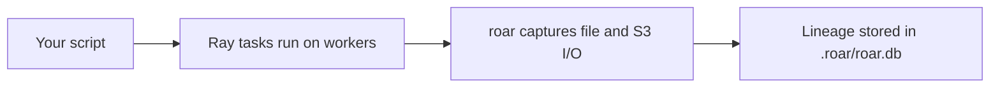

# Ray Integration (End User)

## 1. High-level summary

roar can trace Ray workloads without changing your Ray code. When you run your script through `roar`, it instruments Ray workers, captures what each task reads and writes (local files and S3), and stores the lineage in `.roar/roar.db`.

The result is task-aware lineage instead of driver-only lineage: you can see which Ray task produced an artifact, which task consumed it, and the execution order implied by those dependencies.

## 2. Prerequisites

- `roar` installed and initialized in your project (`roar init`).
- `ray` installed in the environment where your driver runs.
- A Ray setup that supports `runtime_env` worker customization (local clusters and standard remote clusters, including `ray://` client mode).
- For best local file capture, workers should read/write a shared worker-visible path (default examples use `/shared`).

## 3. Usage

Run your existing Ray script with one command:

```bash
roar run python your_ray_script.py
```

Before:
- Your Ray script runs normally, but lineage is mostly at driver level.

After:
- The same script runs normally, plus roar records worker task I/O (file and S3), task attribution, and dependency-aware ordering in `.roar/roar.db`.

## 4. What gets captured

- Worker file I/O (reads/writes seen by worker instrumentation).
- S3 `PutObject`/`GetObject` activity, including ETag when available.
- Per-task attribution (`ray_task_id`, and node metadata when available).
- Task ordering inferred from read/write dependencies (step numbers for Ray task jobs).

## 5. Mental model



## 6. Configuration

The Ray settings most users care about are in `[ray]`:

- `ray.enabled`:
  - Turn Ray instrumentation on/off.
- `ray.log_dir`:
  - Worker log directory used by fallback collection.
- `ray.pip_install`:
  - Controls whether `roar` is injected into `runtime_env.pip` for workers.
- `ray.actor_attribution`:
  - `per_call` (default): each actor method call is tracked separately.
  - `per_actor`: group events at actor granularity.

Useful environment variables:

- `ROAR_WRAP=1`: enables runtime patching path (normally set automatically by `roar run`).
- `ROAR_PROJECT_DIR`: where `.roar/roar.db` is written/read.
- `ROAR_LOG_DIR`: worker fallback log directory.

## 7. Viewing results

CLI inspection:

```bash
roar dag --expanded
roar show @1
roar lineage /path/to/output/artifact
```

Direct DB inspection examples:

```bash
sqlite3 .roar/roar.db "
SELECT job_uid, command, step_number, parent_job_uid
FROM jobs
WHERE job_type = 'ray_task'
ORDER BY step_number, timestamp;
"
```

```bash
sqlite3 .roar/roar.db "
SELECT
  first_seen_path,
  capture_method,
  json_extract(metadata, '$.ray_task_id') AS ray_task_id,
  json_extract(metadata, '$.ray_node_id') AS ray_node_id
FROM artifacts
WHERE first_seen_path LIKE '/shared/%' OR first_seen_path LIKE 's3://%'
ORDER BY first_seen_at DESC;
"
```

```bash
sqlite3 .roar/roar.db "
SELECT j.job_uid, ji.path AS input_path, jo.path AS output_path
FROM jobs j
LEFT JOIN job_inputs ji ON ji.job_id = j.id
LEFT JOIN job_outputs jo ON jo.job_id = j.id
WHERE j.job_type = 'ray_task';
"
```

## 8. Known limitations

- Local file capture in the current worker entrypoint focuses on `/shared/...` paths.
- S3 hashing is ETag-based; ETag is not always a full content hash.
- Multi-node proxy collection relies on optional node-agent/proxy setup.
- Some Ray client paths may require explicit worker startup fallback in task code.
- If a cluster policy blocks required `runtime_env` changes, instrumentation will be partial or unavailable.
