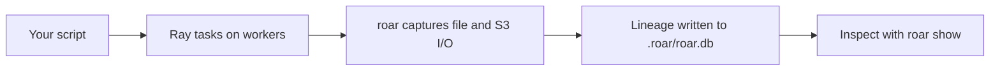

# Ray Integration (End User)

## 1. High-level summary

`roar` can trace Ray workloads without changing your Ray code. Run your script through `roar`, and it captures what Ray tasks read and write across workers, then stores that lineage in `.roar/roar.db` so you can inspect it later.

In practice, this turns Ray execution into queryable lineage: which task produced an artifact, which task read it, and the task order implied by those dependencies.

## 2. Prerequisites

- `roar` is installed and your project is initialized (`roar init`).
- `ray` is installed in the environment where your script runs.
- Supported cluster setups include:
  - local Ray
  - Docker-based Ray deployments
  - remote Ray clusters (including client-style connections)

## 3. Usage

Run your Ray script with this command:

```bash
roar run python your_script.py
```

Before (running plain `python`):
- `.roar/roar.db` mainly reflects driver-level lineage, with limited visibility into worker task I/O.

After (running through `roar run`):
- `.roar/roar.db` includes Ray worker task lineage, artifact reads/writes, task attribution, and dependency-aware ordering.

## 4. What gets captured

- File I/O on Ray workers (reads and writes, with hashes when available).
- S3 `PutObject` and `GetObject` operations (including ETags and byte sizes when available).
- Per-task attribution (which `@ray.remote` task touched which artifacts).
- Step ordering (tasks ordered by artifact dependency topology).

## 5. Mental model



## 6. Configuration

User-facing Ray options in `[ray]`:

- `ray.enabled`
  - Turn Ray tracing on or off.
- `ray.log_dir`
  - Set the worker log directory used for fallback collection.
- `ray.actor_attribution`
  - `per_call` (default): attribute by actor method call.
  - `per_actor`: group attribution by actor.

Helpful environment variables:

- `ROAR_WRAP=1`
  - Enables Ray wrapping (normally set automatically by `roar run`).
- `ROAR_PROJECT_DIR`
  - Controls where `.roar/roar.db` is created/read.
- `ROAR_LOG_DIR`
  - Overrides worker log directory.

## 7. Viewing results

Use `roar show` to inspect runs:

```bash
roar show
```

Example query: artifacts captured per Ray task.

```bash
sqlite3 .roar/roar.db "
SELECT
  j.job_uid,
  j.script AS ray_task,
  a.first_seen_path AS artifact_path,
  io.kind AS io_kind
FROM jobs j
JOIN (
  SELECT job_id, artifact_id, 'input' AS kind FROM job_inputs
  UNION ALL
  SELECT job_id, artifact_id, 'output' AS kind FROM job_outputs
) io ON io.job_id = j.id
JOIN artifacts a ON a.id = io.artifact_id
WHERE j.job_type = 'ray_task'
ORDER BY j.step_number, j.timestamp, io.kind;
"
```

## 8. Known limitations

- Local file capture is strongest for worker-visible shared paths (commonly `/shared`).
- Some read events may not include full content hashes.
- S3 identity is ETag-based, which is not always a full-content digest.
- If cluster/runtime policies block required `runtime_env` behavior, tracing may be partial.
